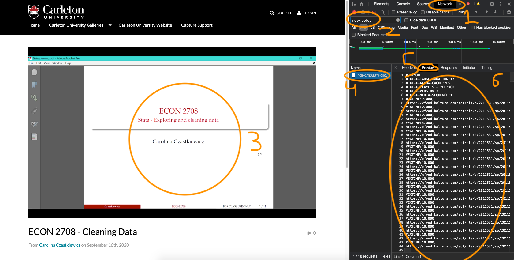

# Using Kaltura Video Downloader

- Instructions are designed for usage on cuLearn (Carleton University's online education platform), however they can be applied to most other platforms using Kaltura

# Requirements

- Google Chrome or Similar Web Browser
- Python3
- VLC or another video player that supports .ts files

# Instructions

1. Go to the cuLearn page of the video that you want to download
2. Open the Developer Console `CMD + ALT + J` (for macs)
3. Navigate to the `Network` Tab (1)
4. In the search `Filter` box type (2)

   ```
   index policy
   ```

5. Hit the Play Button on the Video to capture the request (3)
6. Select the Request from the `Name` column (4)
7. Select `Preview` tab on the request (5)
8. Copy all of the contents of the `Preview` (6)

   

9. Create a new file within the same folder as `kaltura_downloader.py` and name it `dump.txt`
10. Paste the contents that we copied before into `dump.txt`
11. Navigate into the folder and run (you only need to run `pip install` once, so skip this step if you've already used the downloader)

    ```bash
    pip install -r requirements.txt
    ```

12. Then we can run

    ```bash
    python3 kaltura_downloader.py dump.txt outputFile.ts
    ```

13. Open the file with VLC or another player that supports .ts files

> Note: Sometimes you'll get a `Read timed out` error, this typically means that you'll need to update the contents of `dump.txt` or the video isn't supported.
